# The Dialectic of Dominican Identity in Migration: An Ethnographic View of Data

**Author:** Daniel Navarro, MA in Public Policy — Central European University
**Code:** [github.com/Daniel-Navarro-M/dialectical_identity_in_RD](https://github.com/Daniel-Navarro-M/dialectical_identity_in_RD)

---

## Abstract

This study examines how Haitian migration is framed in Dominican public discourse by comparing two Spanish-language corpora: 43 presidential discourses from the Abinader administration (2020–2026) and approximately 8,800 sentences from r/Dominicanos pre-filtered to migration-relevant content. Three complementary topic-modelling approaches — Seeded Latent Dirichlet Allocation anchored to five theoretical themes, unseeded LDA at the same K as a validation step, and DBSCAN clustering on a TF-IDF/SVD projection — are applied to the Reddit corpus alongside a transformer-based Spanish sentiment model, which scores every sentence in both corpora on a continuous positivity scale.

Both hypotheses are supported. Sentences containing Haitian-migration vocabulary carry more negative affect than non-migration sentences in both corpora, with a 10.6 percentage-point gap on Reddit and a 4.6 percentage-point gap in the discourses. The seeded `haiti_migration` topic carries the highest mean negativity of any topic, and DBSCAN surfaces multiple distinct Haiti-related sub-conversations (government framing, legal-status, trafficking and comparative diminishment). Findings support a dialectical reading of Dominican identity constructed in opposition to Haitian identity, most acutely through legal-status vocabulary (*indocumentado*, *deportar*) in unconstrained public discourse and in muted form within the institutional channel.

**Keywords:** Migration · Seeded LDA · DBSCAN · Transformer sentiment analysis · NLP

---

## Table of Contents

1. [Introduction](#1-introduction)
2. [Historical Context](#2-historical-context)
3. [Demography and Migratory Movements](#3-demography-and-migratory-movements)
4. [Method Selection and Justification](#4-method-selection-and-justification)
5. [Data Preprocessing](#5-data-preprocessing)
6. [Initial Findings](#6-initial-findings)
7. [Limitations](#7-limitations)
8. [Conclusions](#8-conclusions)
9. [References](#9-references)

---

## 1. Introduction

*"I would be Borincano even if I was born on the moon"* say the lyrics of Roy Brown. Borinquen is the name given by the Taínos to the island that is now Puerto Rico. 500 years later, Puerto Ricans retain this demonym and the pillar of their identity preserves that indigenous origin, at least in name, since the Taínos were exterminated during colonization. The Taínos lived around these Caribbean islands, one of their homes being the island of Hispaniola. It is an understatement to say that for this island the Taínos are nothing more than an archaeological reference and of which few remains are preserved as a lever to attract tourism. The indigenous origin was blurred between colonization and the internal disputes of the island, but even more, any reference to an indigenous identity dissipated and today there is little or no reference made by Dominicans to their relationship with the primitive communities of the island. Even more striking, there is also little or no reference by Dominicans to an African ancestry. On the other hand, this is *"the most Spanish and traditionalist people in America"* (Joaquín Balaguer, as cited in Jáuregui, 2009), at least as far as the feeling goes, since after the invasion of Haiti there was *"the unfortunate conversion of the western part of Santo Domingo into an obscure extension of Africa"* (Rodríguez, 1955).

Rodríguez (1955) comes to mind for his wonderful summary and great contribution to the invasions of Haiti, but also for the lack of political correctness typical of his time and typical of one of the closest friends of the tyrant Rafael L. Trujillo. In the same book he makes assertions as serious as *"the anthropophagy that usually appears in the lowest layers of the unfortunate Haitian mass"* (p. 10). A little less than 70 years have passed since the publication of the book by this renowned historian, "father of contemporary history", and the discourse on Haiti has changed little. The history of the Dominican Republic could have been constructed from the idea of a *"long racial siege against which a heroic Hispanic resistance is erected"* (Jáuregui, 2009, p. 46). And it is the latter to whom I should entrust my criteria as a contemporary anthropologist, since it is in the aforementioned article where I find support for my ethnographic conjectures through the official story of *El Negro Comegente*, to which I acceded after searching for the tremendous assertion that Rodríguez used, and which, really, is a myth of the racist imaginary.

Seen from the outside, the miscegenation of Dominicans is evident. The Afro roots are undeniable: connections to Africa permeate music, religion, and skin. During my stay I have given myself the task of exploring to some extent that Dominican identity, which denies the blackness of its people. The term *brown* is what is used to refer to Afro, and this category is made almost exclusively for Haitians, who are mostly Afro. It is clear, there is a colorism in the Dominican Republic that ignores the African heritage in an almost caricatural way, and this is well read in Balaguer as Jáuregui (2009) exposes. In this country, whiteness is almost absent and is seen to a lesser extent in some more privileged sectors, since certainly that Creole whiteness was almost eradicated in the Haitian invasions, as Rodríguez (1955) laments. Meanwhile, in a blissful cinnamon color are the Dominican hosts, but they call themselves white daughters of Spaniards.

The ethnic-racial configuration is a matter of self-perception and indeed of self-identification. But that does not limit the possibility of exploring the past and a heritage that inhabits the skin. The question that guides me is: why do Dominicans leave that past aside? And apparently superficial, but why do Puerto Ricans call themselves *Boricuas* and Dominicans are only Dominicans? My answer is that this island has concentrated his identity in the border conflict with the neighboring country Haiti, and has tended to ignore or even deny his ethnic ancestry in the search to perceive himself as different from the Haitian; clinging to the Spanish past that the fathers of the republic admired.

The religion that in the Dominican Republic takes the African deities is called Santería, and if you ask about Haiti, you will hear that they do witchcraft; even though the Orishas have the same names. Irregular immigrants who enter the eastern country are an example of uncivility and victims of contempt for this irregularity. Meanwhile, in an immense irony, Dominican emigration is established among the main ones in the United States (with more than 1 million Dominicans in New York alone, equivalent to the current 10% of the country's population). This comment may shine in some conversation, but it is difficult for a national to accept the similarity of the situations.

In the following report I will try to answer the question: **How is Haitian migration framed in the Dominican Republic Public Debate from a presidential discourse perspective and the Reddit r/Dominicanos forum?** By answering this question I am aiming to understand what the perceptions around Haiti and Haitian migration in the country are. The initial hypotheses are:

- **H1.** Sentences containing Haitian migration vocabulary (`hait*`, `migra*`, `fronter*`, `deport*`, …) carry more negative affect than non-migration sentences in both corpora.
- **H2.** Latent topics in the Reddit dataset include concerns about security and negatively biased mentions such as security risks or negative framing towards the Haitian population.

The testing of this hypothesis is limited, as the data gathered comes from a subreddit that does not represent the entire population of the country, and the control group is a subset of phrases not mentioning Haiti or related topics that has severe issues as a control group. Further research should address this limitation by obtaining a proper control and treatment setting.

This report involves reviewing the border and migration situation between the Dominican Republic and Haiti. However, due to limitations of time and access to information, the border component will be slightly relegated to annotations cited from external sources and some data on the crossing of migrant populations. The approach is as follows: a brief historical framework about the border and a small historical fragment between the Dominican Republic and Haiti, to give a bite to the origins of the disputes between the two countries. From this point, I invite you to reflect on "ethnic self-recognition" in the Dominican Republic, in search of understanding this Dominican-Haitian dialectic that serves as a *"national thing"* (Žižek, 2011) — that point of coalition in which citizens build their common nationality, even if it is based on the discrediting of otherness.

Subsequently, the report focuses on figures and data accessible from the desktop: a brief summary of migratory flows and the basic demographics of migration in the Dominican Republic, mainly using the National Immigrant Survey (2017) and figures published on the Dominican Government's Data Portal. In the second moment, it reviews the official presidential communiqués and Reddit posts as an exploration of the language used when referring to the neighboring country. This section includes the data limitations, scope and exploration necessary for an NLP analysis, and precisely in these communications due to the ease of its collection and given that public opinion might reveal some sentiments around the Haitian identity.

The conclusion is not a discovery worthy of a scientific publication, but a measured confirmation of the intuitions that can be generated when inhabiting the island. That is, to understand that these problems linked to racism and migration are indeed verifiable through the use of Open Data, but also on the magnitude with which they occur. This is also left as evidence that there is still a lot of work to be done for the opening of data and on the formats in which they are published, and that the Dominican Republic is going through a difficult moment of racism and xenophobia that cannot be hidden.

---

## 2. Historical Context

The dispute with Haiti dates back to 1700. Haiti, a French colony, and the east side of Hispaniola. According to Polanco et al. (2017), the establishment of the border with Haiti took place in the treaty of Aranjuez in 1777, where Spain officially recognized the presence of France on the other side of the island (as cited in Polanco et al., 2017; Páez, 2006, p. 38). But a few years later, in 1795 the first border was eliminated in the Treaty of Basel where Spain ceded the island to France in order to recover Catalonia and the Basque Country, which had been taken by Napoleon I Bonaparte, and by 1801 the treaty would take place with the beginning of the Era of France; but before the due possession of France came the sudden invasion of Toussaint Louverture, who took over Santo Domingo *"with luxury of atrocities"* (Rodríguez, 1955).

The possession of the island did not fully take place since the French authorities faced harsh conflicts against the British who also occupied a portion of the east of the island and against the black and mulatto generals who gave birth to the Republic of Haiti in 1804 (Franco, 2009). These revolutionaries led by Jean-Jacques Dessalines, and Toussaint, gave rise to bloody massacres and the disastrous Slaughter of Moca, which caused the emigration of the white population from the east of the island with a reduction of about two-thirds of the population, mainly due to migrations to Venezuela, Puerto Rico and Cuba (Diario Libre, 2010; Rodríguez, 1955). This occupation is probably the point where the Dominican population was mixed to a greater extent, as the Spanish population fled the island and the rest were faced with the destruction of the revolutionaries. Also leaving the first legacy of rancor between the two nations.

From 1809 to 1821 the East became Spanish again, giving rise to the "silly Spain" that would be ended by the independence of Santo Domingo proclaimed by José Núñez de Cáceres. But it would not be until 1822 that the president of Haiti, Boyer, invaded on February 9 and unified the island again (Rodríguez, 1955, p. 14). Domination that is remembered with disgust by the Dominican people (Moya Pons, 1977), and which gave rise to multiple conspiracies against the Haitian dominator, with the most relevant being "the revolution of the Alcarrizos" led by Baltazar de Nova.

By 1843 Boyer fell, and was replaced by Charles Hérard, who would face Duarte, Piña, Sánchez and Pérez, and would lose on March 19, 1844 against Santana, confirming the Dominican Republic proclaimed a month earlier, on February 27, 1844 (Rodríguez, 1955). As a current note, these names extend throughout the modern Dominican Republic, and Santo Domingo has the names and dates printed all over its streets. 27 de Febrero Avenue is the vein of the city, and the Duarte Highway connects it to the neighborhood that saw the birth of the homonymous revolution. Likewise, Elías Piña, with his homonymous region and the others, with avenues, stadiums and sectors remembering their names. **In the Dominican Republic, the founding of the country occurs against Haiti, not against Spain like the rest of Latin America.** And the statues and names are the reminder that the heroes of independence and the fathers of the republic obtained this country by freeing themselves from the Haitian yoke. It is not surprising, then, that differences have crossed the passage of time and the conflict persists, now dressed up as an identity and migratory crisis.

After the declaration of the republic, conflicts between Haitian armies and independence continued and stopped around 1856, when a period of relative calm began. In 1929 the Treaty on the Delimitation of the Border between the two countries was finally approved, because although for years neither government had been concerned with regulating the border situation, a binational commission in 1901 had not been able to reach an agreement for some border areas. Once agreed, the treaty defines the points of delimitation of the border taking up the references of 1777 with the Dajabón River to the north and the Pedernales River to the south.

The four official border points are Ouanaminthe-Dajabón (the most important due to its binational market), Belladère-Comendador, Malpasse-Jimaní and Anse-à-Pitre-Pedernales. The border, in its 380 km extension, is a porous border, which did not have any human construction barrier until 2021 when the construction by the Dominican Republic of a border wall that divides Dajabón and Jimaní and aims to limit the passage of migrants began. Where there is no wall, people continue to walk through unsupervised points, and in the border areas the "border dweller" cards to allow the free transit of people who wish to carry out economic activities in the Dominican Republic during the day and return before the border closure remains an unfinished promise. As a particular fact, the border closes at 6 pm Dominican Republic time, but the time zone in the territories varies for half a year and by a historical curiosity DR has an hour difference with Haiti for half a year. Therefore, between November and March the inhabitants should be careful with their watch and make sure to see the Dominican time.

In conclusion, the border has been the site of multiple disputes between the two nations. Since the arrival of the French, territorialities have entered into dispute, giving rise to conflicts over border layout and later difficulties with the regulation of the passage of people. The Haitian invasion, and the fact that the struggle for the republic has occurred against the neighboring country and not against the European colonizers, poses an important precedent for the identity dispute between the two nations. Haiti, between the fact that the nation's leaders were more concerned with unifying the island than promoting state order and the overwhelming French embargo condemned them to poverty. One of the reasons why Haiti lost to Duarte was because of the internal rebellions in Port-au-Prince, a reason that condemned the social order and its relationship with the neighboring country. Meanwhile, the Dominicans were able to begin their project of nation under the name of "Dominican" already used for 1800. Finally concluding in this tangled relationship, which omits the miscegenation of the Haitian invasion in order to establish itself as that which is the negation of my opposite.

---

## 3. Demography and Migratory Movements

Immigration in the Dominican Republic consists of a large majority of the Haitian population (87.2%), and because this is the only border country I will focus on this population. To describe the characteristics of immigrants in the country, the most complete tool is the National Immigrant Survey (ENI) carried out in 2017, so it will prevail over other sources. According to this survey, there are 570,933 foreigners in the country (although the media reported 2 million); this figure represents 5.6% of the entire population according to the same study, which gives a total of 10,195,232 inhabitants in general for the Dominican Republic.

Among these, men (58.3%) are the majority compared to women (41.7%) and their main characteristic is that they are young, with 39.5% of the total between 20 and 34 years old. Specifically, the Haitian population has a greater male predominance with 62.9%, with the female population being 37.1%; but even more striking, and a particularity of this migratory movement, is that 65.3% of the population in the Dominican Republic is between 20 and 34 years old. What it means is that the Dominican Republic is prominently receiving a flow of young Haitians, probably in search of a future in this country and given the impossibility of finding stability in the country of origin (ENI, 2017).

In the border region there are specific and complex dynamics specific to the region. The border dwellers live off trade between the two countries, but the products are predominantly Dominican given Haiti's scarcity. Crossing the border becomes problematic, as many inhabitants constantly come and go through areas that are not regulated by authorities, and in those where there is regulation, irregular charges made by the immigration authorities themselves abound. In this context of difficult traceability and given the circumstances in which the authorities allow the flows of people without counting them, it would not be surprising if the data on entries and exits through the border are not entirely accurate.

However, the General Directorate of Migration (DGM) in its report for the first half of 2022 counts a total entry at border posts of 169 thousand people entering, and 130 thousand leaving (with almost 40 thousand who could continue on their way to another country or remain in the Dominican Republic). On the other hand, it reports 48,000 deported Haitian nationals, 15,000 repatriated, 33,000 voluntary returns and 32,000 in the "National Army" category for a total of 129,993 people. From this it is concluded that at least a quarter of people who did not return through the border were counted, and an almost equal number of people deported to that of the departures through the border. This figure would mean that at least a quarter of the estimated migrants in the country were deported in that semester, or more likely were deported repeatedly.

Even with this, the number of foreigners in the country is gradually increasing, which makes it more evident that the Dominican Republic's efforts to deport Haitians are not fully working, as those who enter through unofficial points are still left out of the statistics. And as will be seen later, these figures that do not close do not correspond to either naturalizations or people who issue residence permits. But there is also no increase as pronounced as 40 thousand people per semester, so it can be guessed that it is likely that those who have crossed into the Dominican Republic returned.

This data is confirmed to some extent with the ENI, since one of the main characteristics of Haitian migration is its circularity. In this regard, the same survey reports that 63% of the Haitian population has visited their country at least once, 18.8% have visited it more than six (6) times, 79.1% report that their last visit was to visit family or friends, and 0.5% report that their last visit was due to deportation (ENI, 2017). While the increase in immigration is around 40 thousand people in 5 years (ENI, 2017). To verify border crossings, the number of people detained with irregular status at border crossings can be analyzed. An average of 78 thousand people are detained in an irregular condition annually. The annualized data is seen below:

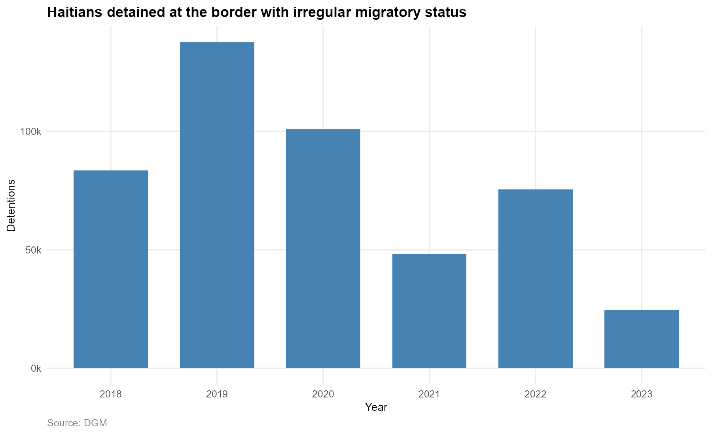

*Figure 1. Haitians detained at the border with irregular migratory status, by year (2018–2023). Source: DGM.*

In fact, there have been years where more than 100 thousand people with irregular status have been captured at the border. This may be only a fraction when compared to those who manage to enter without being apprehended. But it is also the figure that Dominicans fear. Now, you have to take this with a grain of salt. The monthly figure appears below, and dates from almost eight thousand people detained monthly. The reality is that this figure corresponds to people who are detained, who probably try to cross the border again or even cross the border daily and are detained from time to time, but return home. This figure is an indicator of how much the authorities have dedicated in recent years to detaining irregular immigrants, but as we have seen, this does not mean that the number of immigrants is beginning to decrease. The truth is that, in a circular migratory movement, those detained at the border are a salute to the flag, because sooner or later they will cross the wall and eventually also return.

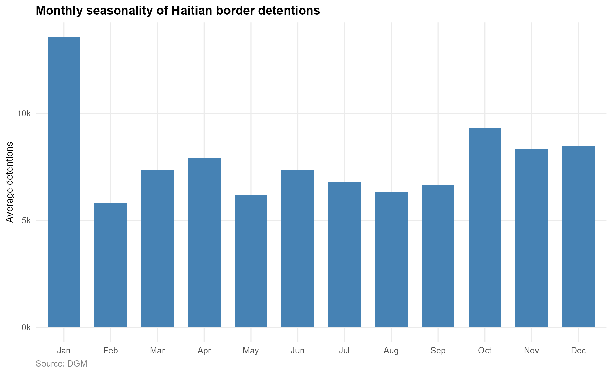

*Figure 2. Average monthly detentions of people at the border in irregular migratory status. Source: DGM.*

The largest number of detainees with irregular status at the border occur in January. This is most likely because immigrants return home for Christmas, and when they come back the flow increases. Immigration is circular, and it is common for Haitians to come and go, even after being deported. Therefore, those detained at the border with irregular status contain high figures, but this is most likely due to double counting, or the constant capture of people coming and going. So no further conclusions can be drawn.

In another instance, some foreigners in the country receive resident status and on some occasions can even be naturalized in the country if they prove any Dominican ancestry. The data published by the DGM includes naturalizations and residencies issued by nationality from 2018 to 2023. Among the aspects to highlight in this regard, Haiti is one of the countries that receives the most residences in these datasets. Among naturalizations, although they are relatively few, Venezuela occupies the first place, and Haiti is somewhat behind being in 7th place (when discounting the *Other* category). The following charts describe naturalizations and residencies:

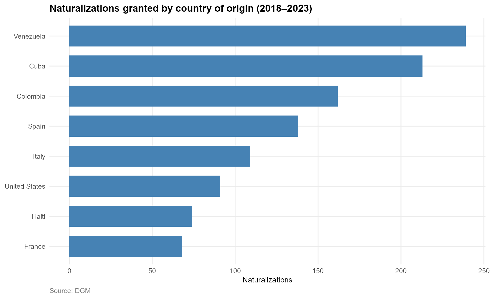

*Figure 3. Naturalizations granted by country of origin (2018–2023). Source: DGM.*

Figure 3 presents naturalizations. Venezuela predominates, as it is a country that has had various flows over time and that still retains many ties. It is followed by Cuba, for the same reason and for its geographical proximity. And finally Colombia and Spain.

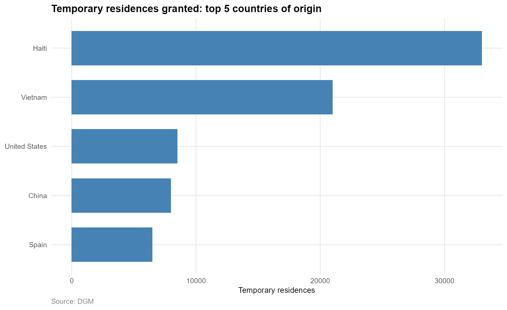

*Figure 4. Temporary residences granted: top 5 countries of origin. Source: DGM.*

Figure 4 presents the top five nationalities of the people who were issued a temporary residence permit. In this one, the importance of Haiti is evident, occupying first place, then Vietnam, which has had a remarkable relevance, and is followed by the United States, China and Spain. Temporary residency is a status that must be renewed annually and is issued primarily to workers and students. In the case of Haitians, many entered the country last century with temporary permits to work in the sugarcane industry under the *bateyes* modality. Modern Haitian immigration is rather focused on areas such as construction and labor that do not require high specialization.

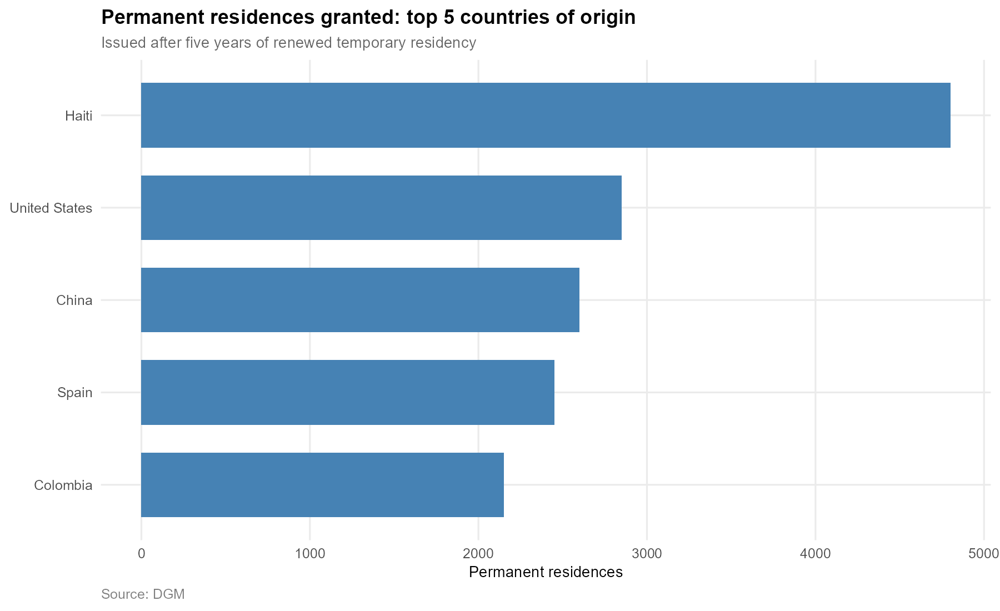

*Figure 5. Permanent residences granted: top 5 countries of origin. Source: DGM.*

Figure 5 refers to permanent residences by country of origin of the person receiving the benefit. Permanent residency is obtained after five years of renewing the temporary residency, and in this case it is also headed by Haitian nationals. Following it is the United States, then China, Spain and finally Colombia.

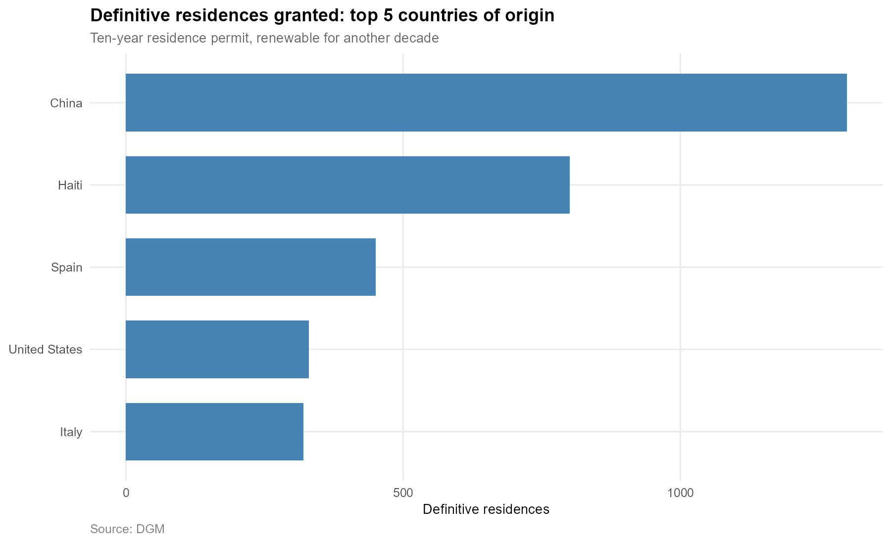

*Figure 6. Definitive residences granted: top 5 countries of origin. Source: DGM.*

Finally, Figure 6 refers to the definitive residences issued by the beneficiary's country of origin. This residency is obtained after having resided regularly in the country for ten (10) years, and is extended as a residence permit for another ten (10) years. In this case, Chinese immigration stands out and is positioned in first place. Then, it is followed again by Haiti, Spain, the United States and finally Italy.

From all of the above, two things can be concluded regarding Haitian immigration in the Dominican Republic. The first is that due to the high arrival of Haitian nationals, they occupy the top positions in terms of residence permits. However, they are quite far behind when it comes to naturalizations. Now, and in a general way, understanding the size of immigration in the country, the limited issuance of permanent residencies and much more naturalizations is striking. Well, at least in the latter, in the selected period only 74 naturalizations have been issued to Haitian nationals, although the population is close to 500 thousand. This opens the question about the children of Dominicans and Haitians, who are usually reported as children of foreigners and do not necessarily receive the treatment of a Dominican. Likewise, the residences for Haitian nationals barely total 35 thousand, which does not represent even 10% of the Haitian population residing in the Dominican Republic, but it is close to the number of people who crossed the border from Haiti and have not returned.

As an addendum, one of the first ideas in this report was to report on the use of Dominican medical facilities by Haitian nationals who cross the border to receive service. In this sense, related information is limited to news sources, who cite that about 30% of births in the Dominican Republic correspond to Haitian mothers who cross the border to have their delivery attended. Public opinion on the Spanish-speaking side of the island, enraged by this figure, continues to reject the use of taxes in the care of foreigners. Although the news cites a report from the Ministry of Health and its databases, in this report the verification of this data was not possible since the ministry's open data page was broken, and the report was not published. Therefore, and understanding the magnitude of the figure cited by the media, the general public is advised to verify sources and check the information obtained from primary sources. Moreover, without access to official sources, nothing can be concluded in this regard.

---

## 4. Method Selection and Justification

For the Natural Language Processing section, I combine three methods. For latent topic structure I fit a Seeded Latent Dirichlet Allocation on the Reddit corpus, anchored to five theoretical themes (`haiti_migration`, `security`, `economy`, `health`, `identity`) plus one residual topic that the model is free to discover. Alongside it I feed an unseeded LDA at the same number of topics and on the same data, which acts as a validation step: if the unseeded model recovers a Haiti/migration cluster without being told to, the seeded result is in the data rather than imposed by the priors. As a third, complementary lens I run DBSCAN on a truncated-SVD projection of the TF-IDF matrix. Density-based clustering does not require a fixed number of clusters and explicitly labels low-density points as noise, which gives a different perspective from LDA's probabilistic mixture: DBSCAN answers *"is this sentence in a dense region of vocabulary-similar sentences?"*, LDA answers *"what theme mixture does this sentence have?"*.

For sentiment I use `pysentimiento/robertuito-sentiment-analysis`, a Spanish RoBERTa fine-tuned for sentiment classification on Spanish social media from the Hugging Face repository. The model returns probabilities over three classes (positive, neutral, negative); I take all three with `top_k = NULL` and combine them into a continuous positivity score in [0, 1] as `p_pos + 0.5 * p_neu`. Negativity is its complement (`1 − positivity`). I picked a transformer over a dictionary method because dictionaries are blind to negation. The Dominican political register is dense with negated negatives, so a dictionary would systematically mis-score the discourse corpus. The transformer reads whole sentences and handles negation as part of its training.

The unit of analysis throughout is the sentence. Transformer sentiment models expect short, single-sentiment text; `pysentimiento/robertuito` specifically was trained on Spanish tweets, so longer posts would either be truncated at the model's token limit or pushed out of the training distribution. Sentence-level scoring also preserves the within-post variation that the H1 test depends on: a single Reddit post can contain a Haiti-mentioning sentence and several non-Haiti sentences, and the comparison is exactly that within-post contrast. The cost is that sentence-level Document-Feature Matrices are sparse (each "document" has few content tokens, so LDA topic-probability distributions are flatter than they would be at paragraph or post level), but the seed-words mechanism keeps the topic content interpretable regardless of sparsity.

Each chosen method has flaws considered when reading the results. Seeded LDA is researcher-controlled by construction: the seed dictionaries and the rare-but-loaded vocabulary whitelist are choices made before looking at sentiment results, but a strict reviewer can still ask how sensitive the topics are to those choices. The unseeded LDA partially addresses this concern by recovering the Haiti cluster without seeds. DBSCAN is sensitive to its two hyperparameters (`eps` and `minPts`); `eps` is picked from the k-nearest-neighbor distance plot and `minPts = 30` is a reasonable default for the dimensionality of the projection but is not the only defensible value. The transformer is trained on Spanish-from-Spain, Argentine and Mexican social media; it generalizes to Dominican Spanish only imperfectly, and some local register may be misread. Truncation at 128 BPE tokens drops the tail of very long sentences, though in practice the dominant sentiment almost always sits in the first clause.

---

## 5. Data Preprocessing

### 5.1 Sources and unit of analysis

Two Spanish-language corpora drive the analysis. The first is a set of 43 presidential discourses scraped from `presidencia.gob.do` covering the Abinader administration from August 2020 to February 2026 with 6,804 sentences after cleaning. The second is a Reddit dataset from r/Dominicanos with around 8,800 sentences after cleaning, pre-filtered to posts and comments that mention any of `haiti`, `haitianos`, `extranjeros`, `inmigrantes`, `inmigracion` or `migracion`. Migration relevance is therefore built into the Reddit corpus from the start, and the within-corpus comparison "migration vs. non-migration sentences" is internal to that filtered universe.

### 5.2 Cleaning and tokenization

Presidential discourse PDFs are split on blank lines to obtain paragraphs and then split into sentences using a Spanish-aware regex (period, question mark or exclamation mark followed by whitespace and a capital letter, including accented capitals). Boilerplate is filtered (page numbers, divider rules, ceremonial stock phrases such as "Asambleístas," and stage directions). Reddit posts and comments are concatenated into a single text field (post = title + body; comment = body), filtering out bots, English posts, and specific irrelevant content. Sentences shorter than 20 characters or longer than 800 are dropped in both corpora to remove fragments and merged-paragraph artifacts. Accents are stripped so that "migración" and "migracion" collapse to the same token.

### 5.3 Custom stoplists and the rare-but-loaded whitelist

I start from the standard Spanish stoplist from `quanteda` and add two layers of corpus-specific noise that the default does not catch. For the discourse corpus I remove ceremonial scaffolding that appears in every speech for structural rather than topical reasons plus a handful of filler connectors that slipped through the standard stoplist. Without this layer every LDA topic would look identical, dominated by the scaffolding rather than the content. For the Reddit corpus the structural noise is platform-specific plus high-frequency filler vocabulary that surfaced when I inspected the top features of a preliminary DFM. I additionally removed Dominican geographic names and one specific publication name (*diario libre*) because a keyness pass flagged them as disproportionately appearing around `hait*`-containing sentences without carrying topical signal. Both stoplists were built by inspecting frequency and keyness output rather than chosen a priori; the lists are documented in the preprocessing source so the choices are auditable.

### 5.4 DFM construction, compounds and whitelist

I compound a small list of multi-word expressions before the stopword step (*cadena perpetua*, *derechos humanos*, *política migratoria*, *puerto plata*, *redes sociales*, *clase media*) so the model treats them as single tokens. Document-Feature Matrices are trimmed with minimum term frequency = 5 and minimum document frequency = 2, but a curated whitelist of around forty rare-but-loaded terms survives trimming regardless of frequency. The whitelist includes (a) the migration and racialization vocabulary that defines my research question (`haiti*`, `migra*`, `inmigra*`, `fronter*`, `deport*`, `indocumenta*`, `extranjer*`, `refugi*`, `raza`, `racis*`, `negro*`, `moreno*`, `blanco*`, `discrimina*`, `perfila*`) and (b) rhetorically loaded terms that a keyness pass over `hait*`-containing documents flagged as disproportionately concentrated there (`invad*`, `salvaje*`, `cobarde*`, `ilegal*`, `violar`, `armad*`, `frenar`, `salvar`). Without this whitelist the most ideologically charged vocabulary would be deleted along with the typos and misspellings that the term frequency cap is designed to remove. No stemming or lemmatization is applied, as the transformer expects surface word forms, and stemming would also collapse ideologically distinct terms like *migrantes* vs. *migración*.

---

## 6. Initial Findings

### 6.1 Migration vocabulary in each corpus

The simplest descriptive signal is the rate at which each corpus reaches for migration-related vocabulary. Per 1,000 tokens, Reddit mentions `hait*` at 25.3, against 1.5 in the presidential corpus. The gap widens further on the contentious cluster `ilegal*` / `indocumenta*` (around 4.1 vs. 0.2) and stays large on `extranjer*` (4.9 vs. 0.6). This is the first piece of evidence, well before any sentiment or topic model is fit, that the public conversation on r/Dominicanos reaches for stronger framing than the institutional one. Which is further accentuated as the discourses are for general subjects, whereas all Reddit posts include some mentioning of Haiti.

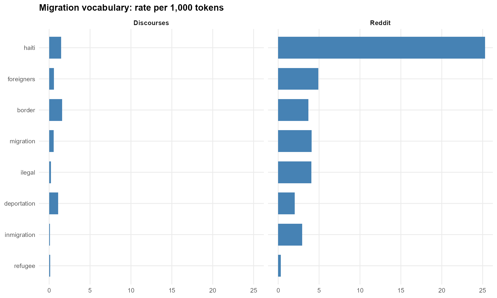

*Figure 7. Migration vocabulary rate per 1,000 tokens, per corpus.*

### 6.2 Topic structure on r/Dominicanos (H2)

The Seeded LDA recovers six interpretable topics on the Reddit corpus. The `haiti_migration` topic is anchored by *haitianos, haiti, frontera, migracion, inmigrantes, gobierno, problema* and *ilegal*: the framing of migration as a problem is built into the topic vocabulary itself. The `security` topic clusters around *pais, tema, seguridad, pueblo, usted, verdad* and *gobierno*; the seed word *seguridad* pulls in framing that reads as opinion-and-judgement rather than crime-specific. The `economy` topic is dominated by *trabajo, economia, turismo, mano, inversion* and *vida*. The `health` topic surfaces *personas, dice, hospitales, extranjeros, sistema, ley* and *salud*: healthcare on r/Dominicanos is heavily intertwined with foreigners and legal access. The `identity` topic collects *cultura, isla, paises, nacional, patria, racismo, historia* and *nacionalidad*. A residual *other* topic absorbs vocabulary (*bien, mejor, dicen, mal, tiempo*) that did not fit any of the anchors.

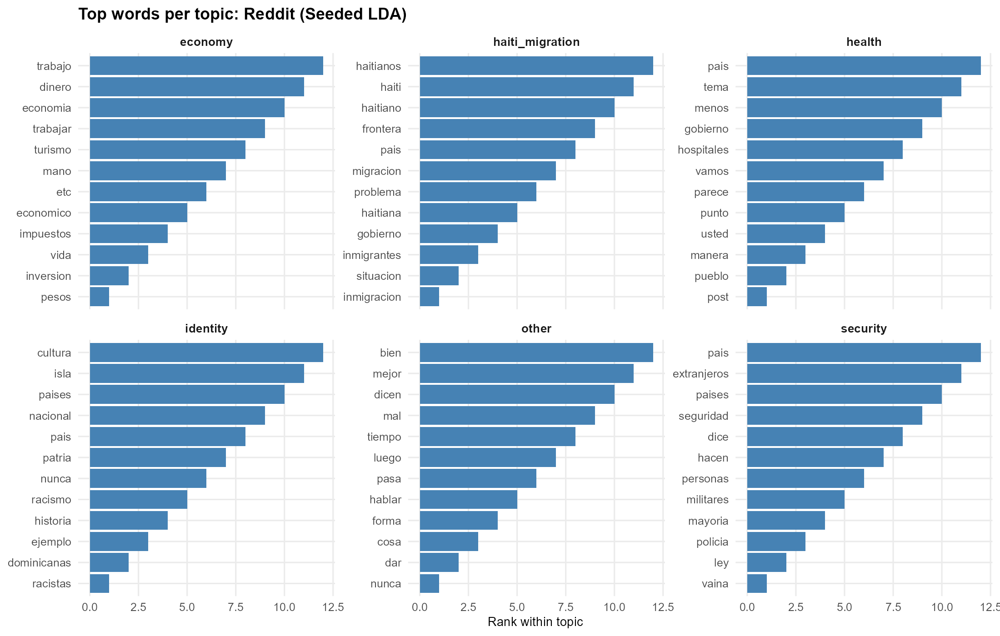

*Figure 8. Top 12 words per topic, Seeded LDA on r/Dominicanos.*

The Unseeded LDA at the same K and with no anchor dictionary is the validation step. If the seed words were manufacturing the migration topic, the unseeded model — given no theoretical priors — would not discover anything resembling it. In practice the unseeded model recovers Haitian-related content in four of its six topics: topic 1 collects vocabulary around Haitians as an issue for the country and the world; topic 3 talks of Haiti, Haitians, the border and migration in the legal context; topic 5 brings Haiti as an international problem; and topic 6 picks up identity and history. Topic 2 is the economy and governance topic (*vivir, bien, vida, dinero, pesos*) and topic 4 is a personal-life topic that doesn't mention Haitians (*mejor, bien, trabajo, dinero, vida*). The migration cluster is not an artifact of the seeds: it is a structural feature of the corpus, and it is widespread enough that two-thirds of the unseeded topics include Haitian vocabulary in their top words.

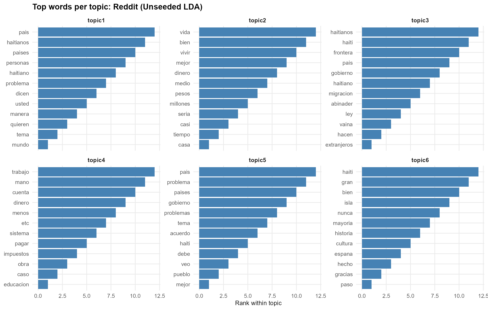

*Figure 9. Top 12 words per topic, Unseeded LDA at the same K (=6). The migration cluster emerges without seed words.*

Topic prevalence on Reddit is roughly uniform — about 17% per topic — which is the expected behavior of sentence-level LDA, where each document has few content tokens and the per-document topic distribution is therefore close to uniform. The substantive information lives in the topic content (the words that define each topic, plotted above) rather than in the per-topic mass.

DBSCAN on the TF-IDF / SVD projection gives a complementary view. On the Reddit sentences it returns six identifiable clusters plus a noise pile. Cluster 1 is a large general-conversation cluster dominated by frequency tokens (*mas, pais, gente, aqui, haitianos, dominicanos*): it is the background mass of the subreddit. The remaining five clusters split into distinct sub-themes. Cluster 2 anchors on *gobierno* and brings together institutional framing of Haitians and *extranjeros*, with *pueblo, hace* and *falta* as the supporting vocabulary. Cluster 3 surfaces a legal-status conversation around *regularización* and *ciudadanía*, with the formal address *usted* dominating the cluster head. Cluster 4 isolates the meta-conversation about migration itself (*tema, inmigracion, tiempo*). Cluster 5 concentrates trafficking and humanitarian framing (*personas, trafico, educadas, alla, nadie, manera*). Cluster 6 is dominated by comparative vocabulary that pits Haitians against Dominicans (*menos, haitianos, dominicanos, tener, ser*). **At least four of the six DBSCAN clusters are explicitly about Haitian-related content**, which reinforces what the LDA already showed but in a different lens: the corpus does not just talk about Haiti, it has identifiable sub-conversations about Haitian governance, Haitian legal status, Haitian trafficking and Haitian-Dominican comparison.

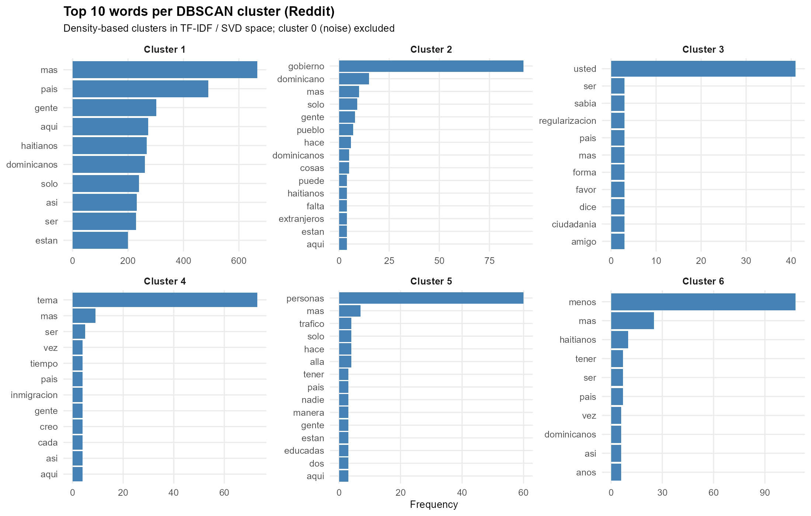

*Figure 10. Top 10 words per DBSCAN cluster on Reddit (cluster 0 noise excluded).*

### 6.3 Sentiment in both corpora (H1)

Sentiment in presidential discourses follows the expected pattern of official communication constrained by diplomatic register. Of the 6,804 discourse sentences, 40.0% are classified as positive, 46.8% as neutral and 13.2% as negative. The positivity distribution is centered above 0.5, with a median around 0.55 and the bulk of values between 0.4 and 0.8. The narrative arc stays steadily on the positive side throughout the Abinader administration.

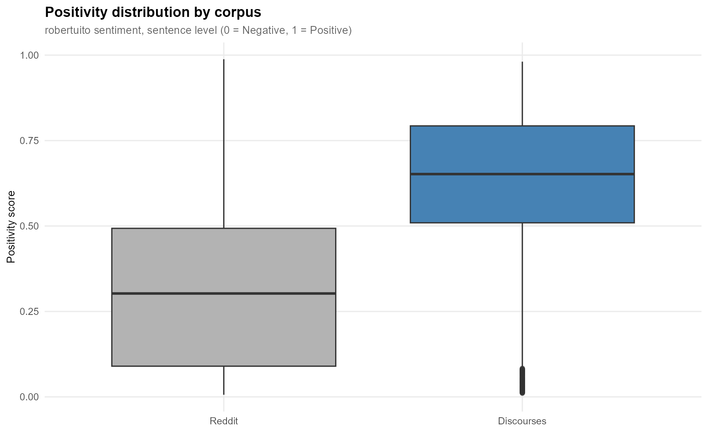

*Figure 11. Positivity distribution by corpus (sentence level). 0 = fully negative · 0.5 = neutral · 1 = fully positive.*

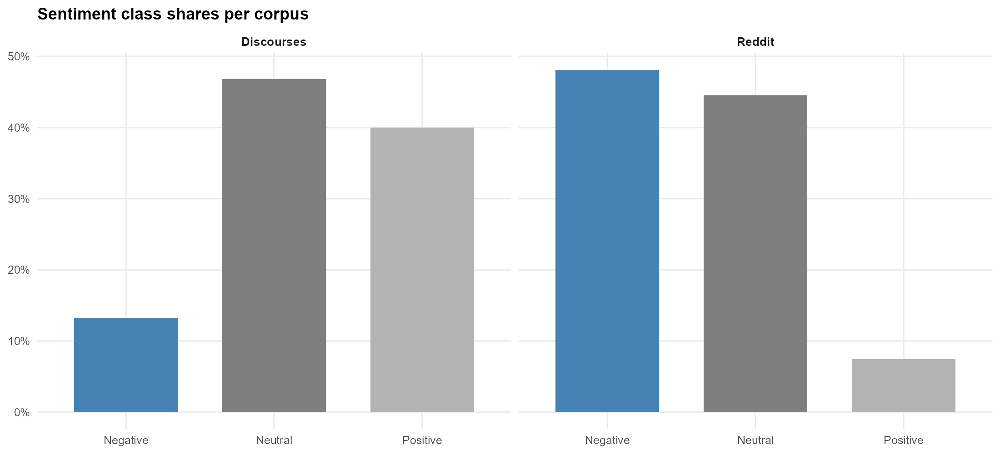

*Figure 12. Sentiment class shares per corpus (positive / neutral / negative).*

Reddit shows the near-mirror image. Only 7.4% of the roughly 8,800 Reddit sentences are classified as positive; 44.5% are neutral and 48.1% are negative — almost a six-fold reversal of the discourse balance. The positivity boxplot is centered well below 0.5, and the narrative arc oscillates around the negative-leaning half of the axis rather than the positive one. The contrast between the two corpora is the headline descriptive finding of the sentiment side of this analysis.

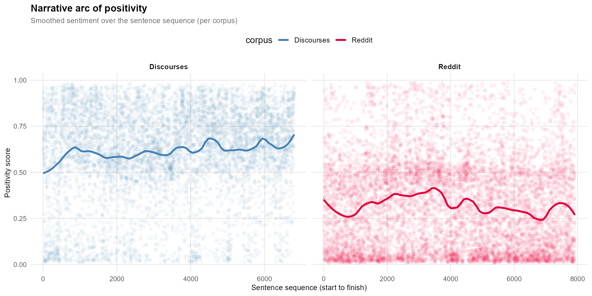

*Figure 13. Narrative arc of positivity per corpus. The LOESS line smooths over the bimodal raw scores and shows the average drift.*

The direct H1 test compares mean negativity in migration-vocabulary sentences against non-migration sentences within each corpus. On discourses, the 251 migration-vocabulary sentences carry a mean negativity of 0.432 against 0.386 for the 6,553 non-migration sentences — a 4.6 percentage-point gap in the direction predicted by H1, small in magnitude but consistent. On Reddit the gap is much larger: 0.763 mean negativity in the 1,518 migration sentences against 0.657 in the 6,400 non-migration sentences — a 10.6 percentage-point gap. The violin plot shows both Reddit groups sitting on the negative half of the axis, but the migration distribution is visibly shifted further toward 1 with a heavier upper tail. **H1 holds in both corpora; the magnitude of the effect is the difference.**

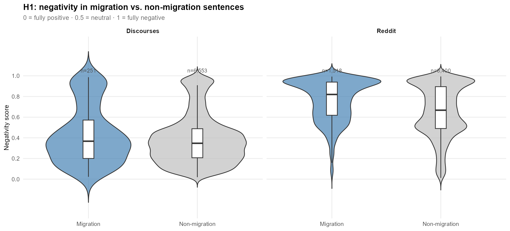

*Figure 14. Violin + boxplot of negativity in migration vs. non-migration sentences, per corpus.*

Splitting the migration vocabulary by individual keyword family shows which terms carry the strongest negative load. On Reddit, mean negativity is highest for `indocumenta*` (0.812, n = 21), followed by `deport*` (0.777, n = 94), `hait*` (0.768, n = 1,036), `inmigr*` (0.761, n = 128), `migra` (0.750, n = 314) and `fronter*` (0.745, n = 160). The legal-status cluster (`indocumenta*`, `deport*`) is the most rhetorically charged piece of the migration vocabulary in the corpus, which is consistent with the DBSCAN cluster 3 finding around regularization and citizenship (`ciudadan*`).

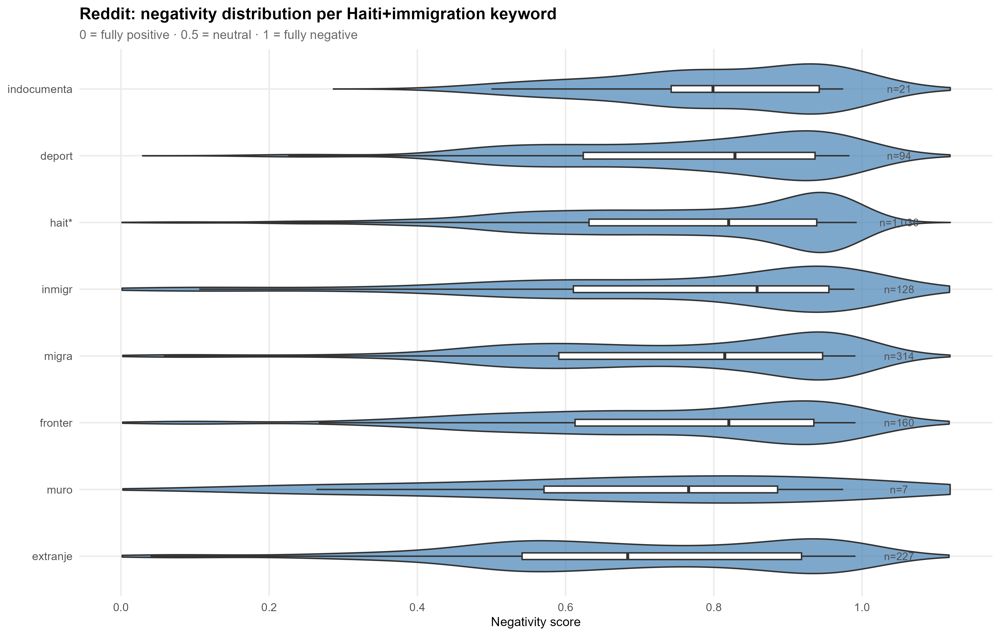

*Figure 15. Violin + boxplot of negativity per Haiti+immigration keyword family on Reddit.*

Crossing sentiment with topic by assigning each Reddit sentence its dominant seeded-LDA topic gives the most direct read on the interaction between H1 and H2. The `haiti_migration` topic carries the highest mean negativity (0.746) of any topic, followed by `identity` (0.689), the residual `other` (0.688), `security` (0.670), `health` (0.635) and `economy` (0.624). The boxplot confirms that the `haiti_migration` distribution is shifted toward 1 relative to the others, with both the median and the interquartile range above any other topic. The negative mass concentrates exactly where the research question predicts: in the migration topic itself, not diffused across the corpus.

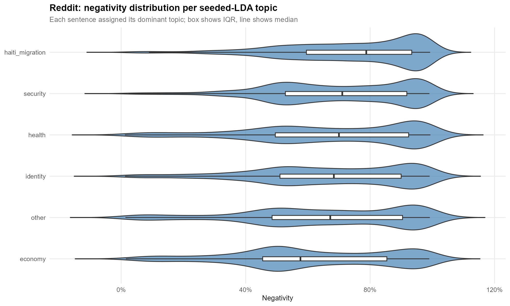

*Figure 16. Negativity distribution per dominant seeded-LDA topic on Reddit.*

### 6.4 Cross-corpus interpretation

Two patterns hold across corpora and methods. First, the institutional and the public channel differ more in *intensity* than in *direction*: both reach for migration vocabulary more negatively than for non-migration vocabulary, but the diplomatic register dampens the magnitude in presidential discourse while the unconstrained Reddit register amplifies it. Second, the framings that organize public conversation around Haiti are security, legal-status and identity, not economic or healthcare framings. The topic-by-sentiment cross shows that the `haiti_migration` and `identity` topics carry the negative mass; the `economy` and `health` topics are noticeably less negative. This is consistent with the dialectical reading that Dominican identity is built in opposition to Haitian identity: when Dominicans on r/Dominicanos discuss Haitians, the conversation is not primarily about economic competition or healthcare burden in the abstract — it concentrates on legality, presence, race and cultural difference, and it does so negatively.

---

## 7. Limitations

Three limitations qualify the scope of these findings on the data side. The Reddit corpus is pre-filtered to posts and comments that already mention Haiti, migration or foreigners, which means the within-corpus comparison between migration and non-migration sentences is internal to a corpus already filtered for migration relevance — the H1 gap is therefore a conservative estimate of the difference between Haiti-talk and general subreddit conversation rather than a clean reference distribution. r/Dominicanos itself is not a representative sample of the Dominican public: it skews young, urban, online and atypically engaged with politics, so claims about "public discourse" are bounded by this and cannot be read as nationally representative. On the institutional side, `presidencia.gob.do` hosts only the last six years of discourses, all from the Abinader administration, which makes the discourse corpus an Abinader-era slice rather than a multi-administration comparison.

Three further limitations come from the modeling choices. Sentence-level topic models are sparse because each document has few content tokens, which means the per-document topic probability distribution sits close to uniform and the 16–17% per-topic prevalence numbers are a sparsity artifact rather than a finding — the seed words pin the topic content interpretably, but the prevalence values should be read comparatively rather than as absolute mass. The transformer (RoBERTuito) was trained on Spanish tweets primarily from Argentina, Spain and Mexico, so its generalization to Dominican Spanish is reasonable but not perfect, and some local slang or political register may be misread; a small manual audit of a stratified sample of model outputs would be a sensible robustness check. Finally, the custom stoplists, the rare-but-loaded whitelist and the seed dictionaries are researcher choices made during preprocessing. They are documented in the code so the choices are auditable, and the unseeded LDA partially addresses the concern on the topic side, but on the sentiment side this dependence on researcher-made decisions remains a real limitation of the present analysis.

---

## 8. Conclusions

This project compared how Haitian migration is framed in two Spanish-language corpora: 43 presidential discourses from the Abinader administration (2020–2026) and roughly 8,800 sentences from r/Dominicanos pre-filtered to migration-relevant content. The pipeline brings together three lenses on the same Reddit data — Seeded LDA, Unseeded LDA at the same K and DBSCAN on a TF-IDF/SVD projection — to triangulate the topic structure of public conversation, alongside a transformer-based Spanish sentiment model (`pysentimiento/robertuito`) that scores every sentence in both corpora on a continuous positivity scale. The choice of a transformer over a dictionary method is methodologically important here: the Dominican political register is dense with negated negatives, and a dictionary lookup would have systematically mis-scored the discourse corpus by missing the negation context that the transformer handles natively.

Both hypotheses are supported by the analysis. **H1 holds in both corpora** — sentences containing Haiti-and-migration vocabulary carry more negative affect than non-migration sentences, with the gap an order of magnitude larger on the public side (10.6 percentage points on Reddit) than on the institutional side (4.6 percentage points in the discourses). **H2 is supported on both the existence side and the affect side**: the Seeded LDA recovers a coherent `haiti_migration` topic, the Unseeded LDA validates it by surfacing Haitian-related vocabulary in four of six topics with no anchor dictionary, the DBSCAN clustering reveals multiple distinct Haiti-related sub-conversations (government framing, legal-status discussion, trafficking discourse and comparative diminishment), and the seeded `haiti_migration` topic carries the highest mean negativity of any topic on the Reddit corpus.

The combined picture is consistent with the dialectical reading that Dominican public discourse organizes itself around Haiti not as a neutral or instrumental topic but as a carrier of identity-opposition and threat framings, most acutely around legal-status terminology (*indocumentado*, *deportar*). The institutional channel does the same in muted form: same direction, smaller magnitude, register-constrained by the diplomatic context in which the speeches are delivered. For that reason, it becomes evident and measurable that the Haitian identity is an opposition of the Dominican one, built upon negative discourses that deny and exclude systematically the neighboring country's people. Seen both at the discourse level, and at the ethnographic level.

---

## 9. References

- Blei, D. M., Ng, A. Y., & Jordan, M. I. (2003). Latent Dirichlet allocation. *Journal of Machine Learning Research*, 3, 993–1022. <https://doi.org/10.1162/jmlr.2003.3.4-5.993>
- Diario Libre. (2010, March 6). *Demografía Dominicana (1795–1844)*. <https://www.diariolibre.com/opinion/lecturas/demografa-dominicana-1795-1844-NJDL236812>
- Franco, F. J. (2009). *Historia del pueblo dominicano* (6th ed.). Sociedad Editorial Dominicana.
- Jáuregui, C. A. (2009). El "Negro Comegente": Terror, colonialismo y etno-política. *Afro-Hispanic Review*, 28(1), 45–79. <http://www.jstor.org/stable/41350895>
- Mohammad, S., & Turney, P. (2010). Emotions evoked by common words and phrases: Using Mechanical Turk to create an emotion lexicon. In *Proceedings of the NAACL-HLT 2010 Workshop on Computational Approaches to Analysis and Generation of Emotion in Text*. <http://saifmohammad.com/WebPages/lexicons.html>
- Moya Pons, F. (1977). *Manual de Historia Dominicana*. Universidad Católica Madre y Maestra.
- Páez, W. (2006). *La frontera domínico-haitiana: perspectiva histórica y presente*. Archivo General de la Nación.
- Polanco, V., Castillo, E., Chalas, N., & Reyes, R. (2017). Migraciones en la frontera Haití–República Dominicana: Una mirada descriptiva a una realidad compartida. In *Los Movimientos Migratorios en las Fronteras Iberoaméricanas*. Editorial Kamar.
- Rodríguez Demorizi, E. (1955). *Invasiones haitianas de 1801, 1805 y 1822*. Editora Montalvo.
- Žižek, S. (2011). *El acoso de las fantasías*. Akal.

---

## Replication

The pipeline is organized into five R scripts that run top to bottom:

| Script | What it does |
|---|---|
| `01_data_collection.R` | Scrape presidential discourses from `presidencia.gob.do` |
| `02_preprocessing.R` | Build sentence-level corpora, DFMs and metadata for both corpora |
| `03_RD_descriptive_stats.R` | Generate the migration/residency descriptive plots (Figures 1–6) |
| `04_NLP_topics.R` | Seeded LDA, Unseeded LDA and DBSCAN on the Reddit corpus (Figures 7–10) |
| `05_NLP_sentiment.R` | Spanish RoBERTa sentiment via reticulate; H1 tests (Figures 11–16) |

The Python side requires `pysentimiento/robertuito-sentiment-analysis` via HuggingFace `transformers`, called through `reticulate` from R.
